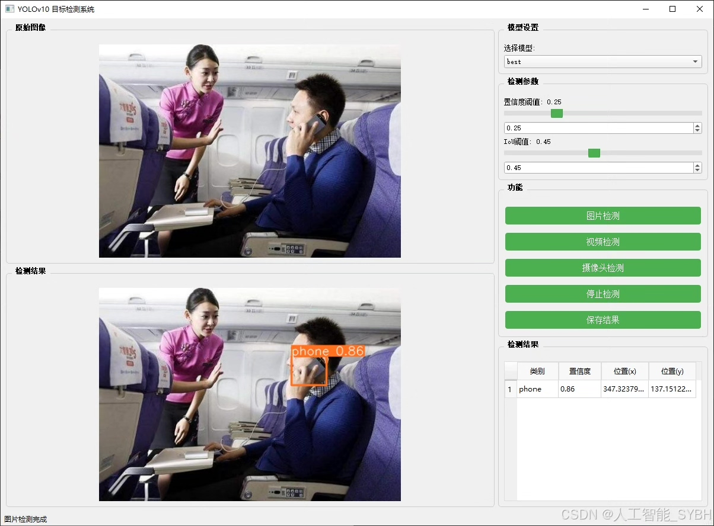
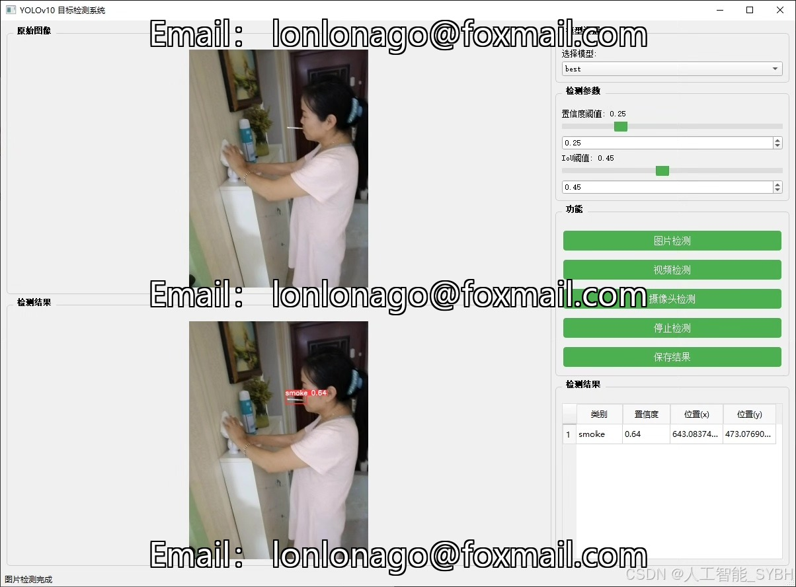
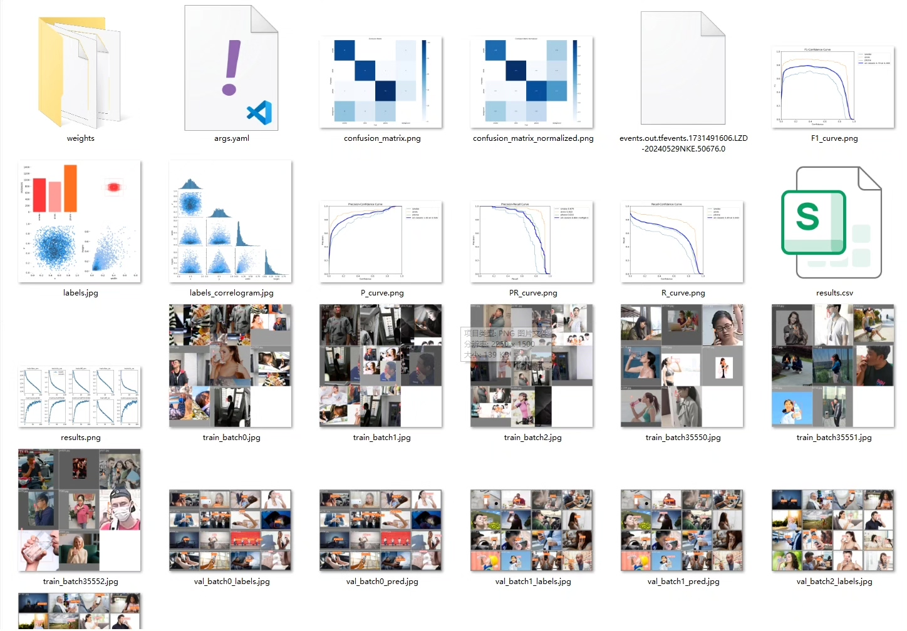
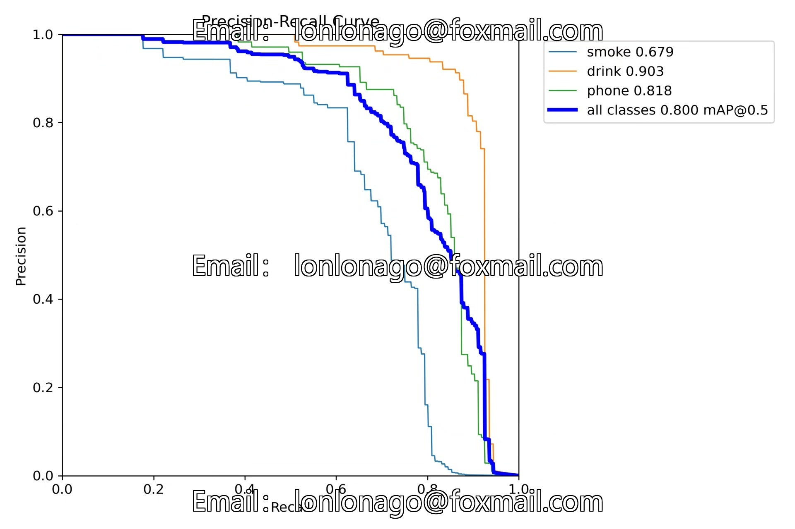
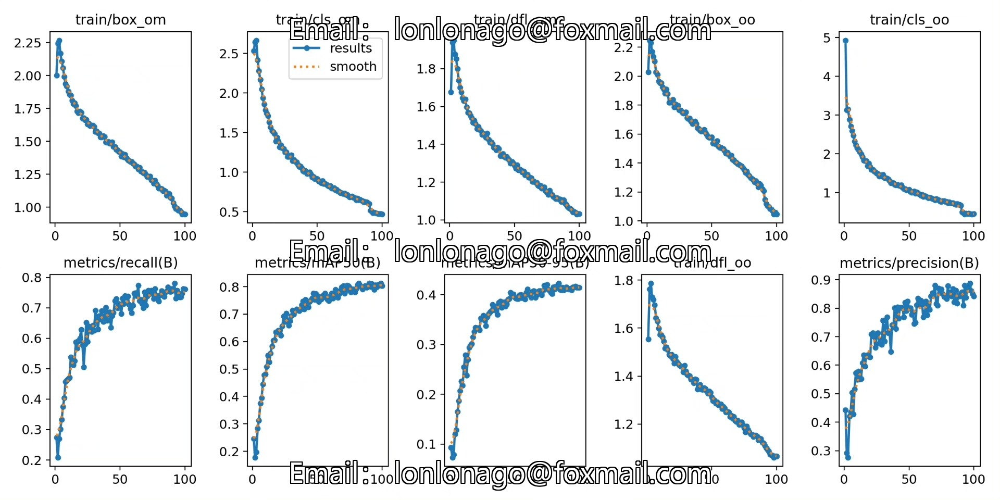
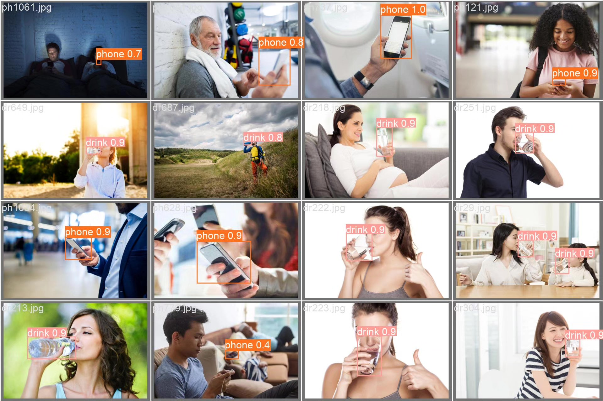
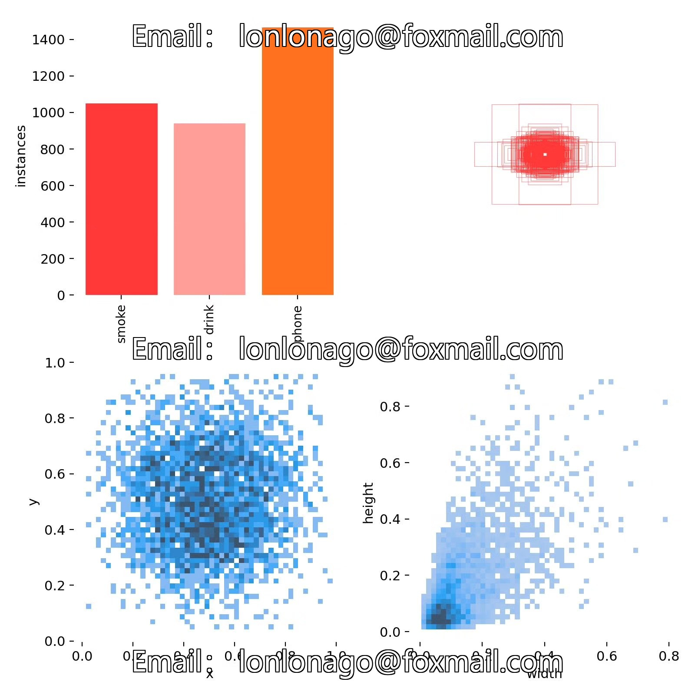
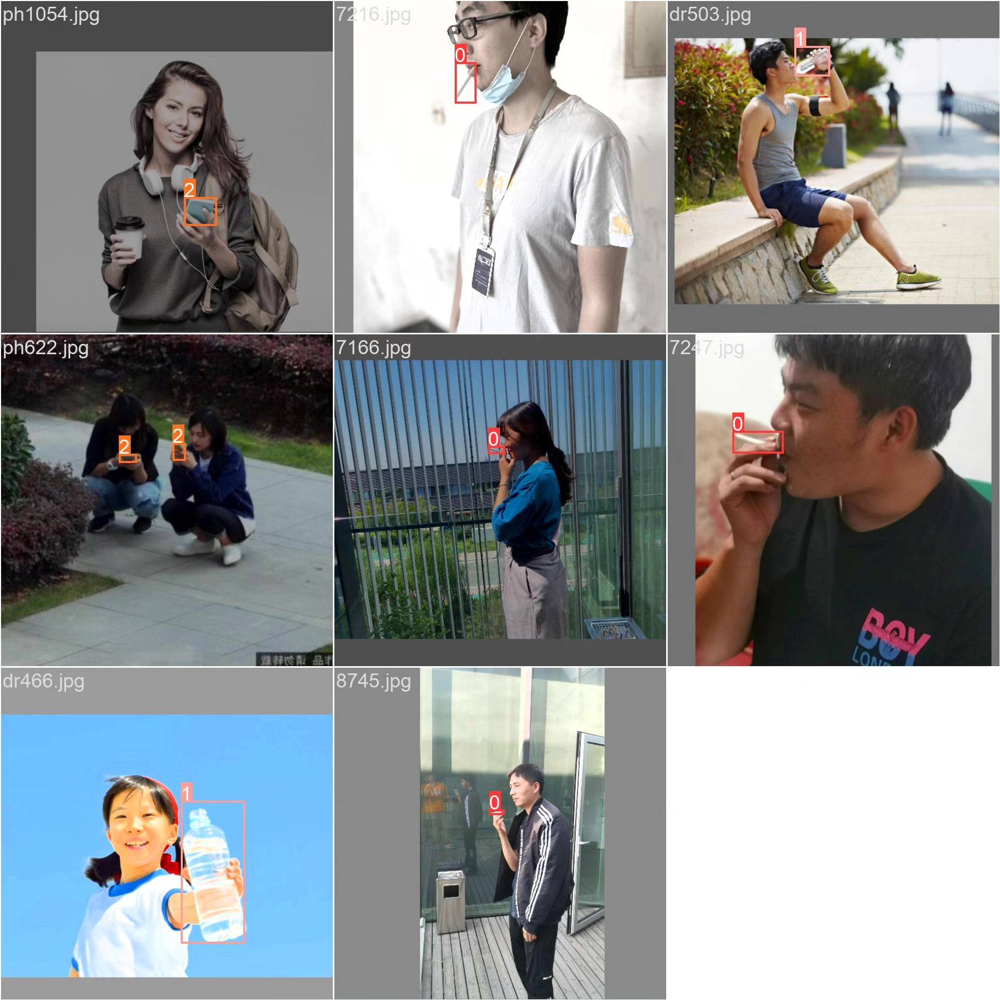

# Based on deep learning YOLOv10 for smoking and drinking detection in mobile phones (YOLOv

## Body

This project aims to utilize deep learning technology (such as YOLOv10) to build an efficient and accurate smoking, drinking water, and mobile phone detection system. The system can detect smoking, drinking water, or using a mobile phone in real-time from images or videos, and output the detection results. By training and optimizing the model, the system can accurately identify these behaviors in complex backgrounds, meeting the needs of public place monitoring and management.

The company's products have obtained the official commercial license certification of YOLO.

We provide after-sales service.

After payment, we will provide WeChat ID for any questions.

Environment configuration: We will provide a tutorial on environment configuration, and WeChat will provide answers.

Remote installation service: If you need remote configuration, an additional fee of 69 is required, with all fees refunded if the configuration fails (only refund installation fees for older computers).

Retraining dataset: After setting up the environment, you can train on your own computer. If you need us to retrain, just pay 69 plus computing power fees (2.5 yuan/hour).

Full after-sales service

## Images

## Payment

Here is a pay link on Stripe ( https://buy.stripe.com/3cs8yP7sY87d0vu9AB ). Please contact me lonlonago@foxmail.com after funding $89, and I will send you a complete data files , thank you!

